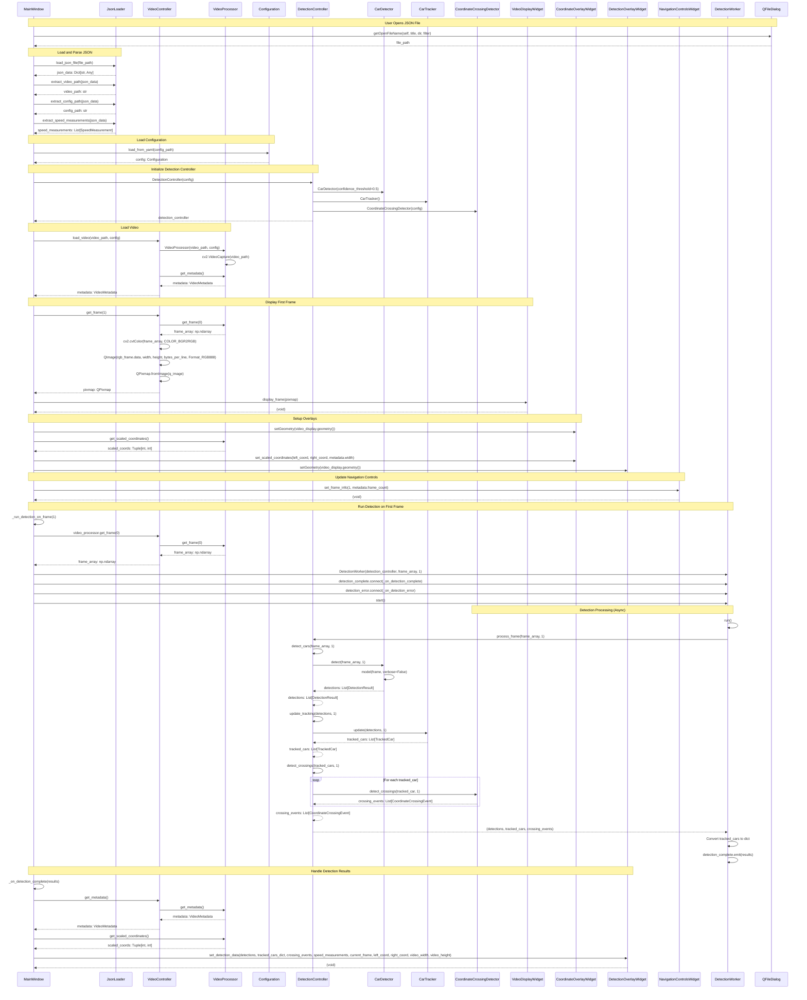

```mermaid
sequenceDiagram
    participant MW as MainWindow
    participant JL as JsonLoader
    participant VC as VideoController
    participant VP as VideoProcessor
    participant Config as Configuration
    participant DC as DetectionController
    participant CD as CarDetector
    participant CT as CarTracker
    participant CCD as CoordinateCrossingDetector
    participant VDW as VideoDisplayWidget
    participant COW as CoordinateOverlayWidget
    participant DOW as DetectionOverlayWidget
    participant NCW as NavigationControlsWidget
    participant DW as DetectionWorker
    participant QFD as QFileDialog

    Note over MW,QFD: User Opens JSON File
    MW->>QFD: getOpenFileName(self, title, dir, filter)
    QFD-->>MW: file_path
    
    Note over MW,JL: Load and Parse JSON
    MW->>JL: load_json_file(file_path)
    JL-->>MW: json_data: Dict[str, Any]
    MW->>JL: extract_video_path(json_data)
    JL-->>MW: video_path: str
    MW->>JL: extract_config_path(json_data)
    JL-->>MW: config_path: str
    MW->>JL: extract_speed_measurements(json_data)
    JL-->>MW: speed_measurements: List[SpeedMeasurement]
    
    Note over MW,Config: Load Configuration
    MW->>Config: load_from_yaml(config_path)
    Config-->>MW: config: Configuration
    
    Note over MW,DC: Initialize Detection Controller
    MW->>DC: DetectionController(config)
    DC->>CD: CarDetector(confidence_threshold=0.5)
    DC->>CT: CarTracker()
    DC->>CCD: CoordinateCrossingDetector(config)
    DC-->>MW: detection_controller
    
    Note over MW,VP: Load Video
    MW->>VC: load_video(video_path, config)
    VC->>VP: VideoProcessor(video_path, config)
    VP->>VP: cv2.VideoCapture(video_path)
    VC->>VP: get_metadata()
    VP-->>VC: metadata: VideoMetadata
    VC-->>MW: metadata: VideoMetadata
    
    Note over MW,VDW: Display First Frame
    MW->>VC: get_frame(1)
    VC->>VP: get_frame(0)
    VP-->>VC: frame_array: np.ndarray
    VC->>VC: cv2.cvtColor(frame_array, COLOR_BGR2RGB)
    VC->>VC: QImage(rgb_frame.data, width, height, bytes_per_line, Format_RGB888)
    VC->>VC: QPixmap.fromImage(q_image)
    VC-->>MW: pixmap: QPixmap
    MW->>VDW: display_frame(pixmap)
    VDW-->>MW: (void)
    
    Note over MW,COW: Setup Overlays
    MW->>COW: setGeometry(video_display.geometry())
    MW->>VP: get_scaled_coordinates()
    VP-->>MW: scaled_coords: Tuple[int, int]
    MW->>COW: set_scaled_coordinates(left_coord, right_coord, metadata.width)
    MW->>DOW: setGeometry(video_display.geometry())
    
    Note over MW,NCW: Update Navigation Controls
    MW->>NCW: set_frame_info(1, metadata.frame_count)
    NCW-->>MW: (void)
    
    Note over MW,DW: Run Detection on First Frame
    MW->>MW: _run_detection_on_frame(1)
    MW->>VC: video_processor.get_frame(0)
    VC->>VP: get_frame(0)
    VP-->>VC: frame_array: np.ndarray
    VC-->>MW: frame_array: np.ndarray
    
    MW->>DW: DetectionWorker(detection_controller, frame_array, 1)
    MW->>DW: detection_complete.connect(_on_detection_complete)
    MW->>DW: detection_error.connect(_on_detection_error)
    MW->>DW: start()
    
    Note over DW,CCD: Detection Processing (Async)
    DW->>DW: run()
    DW->>DC: process_frame(frame_array, 1)
    
    DC->>DC: detect_cars(frame_array, 1)
    DC->>CD: detect(frame_array, 1)
    CD->>CD: model(frame, verbose=False)
    CD-->>DC: detections: List[DetectionResult]
    DC-->>DC: detections: List[DetectionResult]
    
    DC->>DC: update_tracking(detections, 1)
    DC->>CT: update(detections, 1)
    CT-->>DC: tracked_cars: List[TrackedCar]
    DC-->>DC: tracked_cars: List[TrackedCar]
    
    DC->>DC: detect_crossings(tracked_cars, 1)
    loop For each tracked_car
        DC->>CCD: detect_crossings(tracked_car, 1)
        CCD-->>DC: crossing_events: List[CoordinateCrossingEvent]
    end
    DC-->>DC: crossing_events: List[CoordinateCrossingEvent]
    
    DC-->>DW: (detections, tracked_cars, crossing_events)
    DW->>DW: Convert tracked_cars to dict
    DW->>DW: detection_complete.emit(results)
    
    Note over MW,DOW: Handle Detection Results
    MW->>MW: _on_detection_complete(results)
    MW->>VC: get_metadata()
    VC->>VP: get_metadata()
    VP-->>VC: metadata: VideoMetadata
    VC-->>MW: metadata: VideoMetadata
    MW->>VP: get_scaled_coordinates()
    VP-->>MW: scaled_coords: Tuple[int, int]
    MW->>DOW: set_detection_data(detections, tracked_cars_dict, crossing_events, speed_measurements, current_frame, left_coord, right_coord, video_width, video_height)
    DOW-->>MW: (void)
```

